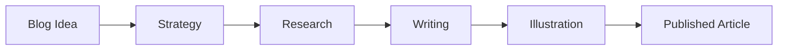

# Illustration Skill

## What This Skill Does

Enhances a written article with visual assets — Mermaid diagrams, ASCII art, SVG illustrations, and image generation prompts — replacing placeholder markers with actual visuals.

## When to Use

Use this skill when the orchestrator delegates the **illustration phase** of the blog pipeline. The subagent receives the complete article with `<!-- ILLUSTRATION: ... -->` markers and an illustration brief.

## Output Artifacts

### 1. Illustrated Article

The complete article with all `<!-- ILLUSTRATION: ... -->` markers replaced by actual visual content embedded inline.

### 2. Visual Asset Summary

```markdown
## Visual Assets Created

### 1. [Illustration Name]
- Type: [mermaid / ascii / svg / image-prompt]
- Location: [which section]
- Purpose: [what it communicates]
```

### 3. Metadata JSON

```json
{
  "title": "...",
  "slug": "...",
  "excerpt": "...",
  "keywords": ["..."],
  "wordCount": 0,
  "readTime": "X min",
  "illustrations": [
    { "type": "mermaid", "location": "section-1", "description": "..." }
  ],
  "createdAt": "ISO date"
}
```

## Visual Types

### Mermaid Diagrams
**Best for:** processes, workflows, architectures, sequences, comparisons
**When:** article describes a process, system architecture, decision tree, or timeline



### ASCII Art
**Best for:** developer audiences, terminal-themed content, lightweight diagrams
**When:** targeting developers and the visual is simple enough for ASCII

```
+--------------+     +--------------+
|   Frontend   |---->|   Backend    |
+--------------+     +--------------+
                           |
                     +-----v-----+
                     | Database  |
                     +-----------+
```

### SVG Illustrations
**Best for:** inline charts, simple graphics, icons, visual metaphors
**When:** lightweight, scalable visual needed without external dependencies

### Image Generation Prompts
**Best for:** hero images, concept art, editorial photography, social cards
**Format:**
```
<!-- IMAGE: A flat illustration of [detailed description].
Style: [art style, colors]. Dimensions: 1200x630 -->
```

## Principles

- **Visuals communicate, not decorate.** Every illustration must convey information that text handles poorly. If text already explains it clearly, a visual is redundant.
- **Match the article's tone.** Technical deep-dive gets clean diagrams. Thought leadership gets conceptual illustrations. Tutorial gets step-by-step flows.
- **Mermaid is the primary tool.** Renders natively in most Markdown environments.
- **Less is more.** 3-5 well-placed visuals > 10 scattered ones.

## Anti-Patterns

- **Diagram for everything** — not every section needs a visual
- **Overly complex Mermaid** — 20+ nodes is unreadable; simplify or split
- **Decorative illustrations** — stock-photo-feeling visuals with zero information
- **Inconsistent style** — mixing playful ASCII with formal SVG in the same article
- **Breaking the reading flow** — visuals at natural pause points, not mid-argument
