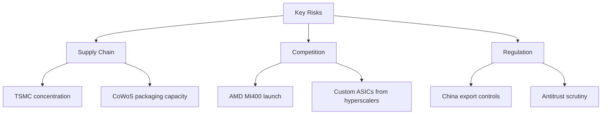

# Rich Document Display for AI Agent Research Output

**Status**: Proposal
**Date**: 2026-02-18
**Scope**: Enable AI agents to display deep research (financial, quant, scientific) with interactive data visualizations

---

## 1. Problem Statement

AI agents performing deep research (financial analysis, quantitative modeling, scientific reports) currently output plain markdown text. This limits the ability to communicate:

- **Interactive charts** (candlestick, time series, scatter plots, heatmaps)
- **Sortable/filterable data tables** with large datasets
- **Multi-panel dashboards** with coordinated views
- **Live computations** (what-if scenarios, parameter tuning)
- **Rich layouts** combining narrative, data, and visualizations

We need a rendering system that lets agents produce rich, interactive research documents while maintaining security, streaming compatibility, and architectural consistency with AionUi.

---

## 2. Current Architecture

AionUi already has a strong foundation:

| Capability | Stack | Location |
|---|---|---|
| Markdown rendering | `react-markdown` + `remark-gfm` + `remark-math` + `rehype-katex` | `src/renderer/components/Markdown.tsx` |
| Code fence detection | Language tag matching (`/language-(\w+)/`) with special handlers for `latex`/`math`/`tex` | `Markdown.tsx:93-113` |
| Preview system | Tabbed multi-type viewer (markdown, HTML, code, diff, PDF, Excel, images, Excalidraw) | `src/renderer/pages/conversation/preview/` |
| HTML sandboxing | iframe-based HTML preview with Monaco editor | `HTMLViewer.tsx` |
| Shadow DOM isolation | Style-isolated markdown rendering with theme bridging | `Markdown.tsx:222+` |
| Streaming | `Streamdown` library for incremental markdown parsing | `MarkdownViewer.tsx` |
| Content types | `PreviewContentType` union type in `src/common/types/preview.ts` | Extensible |

**Key insight**: The code fence handler in `Markdown.tsx:93` is the natural extension point. It already dispatches `latex`/`math`/`tex` to KaTeX. Adding `chart`, `table`, `mermaid`, and `artifact` follows the same pattern.

---

## 3. Approaches Evaluated

### 3.1 MDX (Markdown + JSX) — Not Recommended

| Factor | Assessment |
|---|---|
| Security | **Poor** — MDX compiles to executable JS. Agent-generated MDX runs arbitrary code in the renderer process. |
| Streaming | **Poor** — Requires full compilation pass; incompatible with `Streamdown`'s token-by-token rendering. |
| Integration | **Breaking** — MDX uses its own compiler (`@mdx-js/mdx`), not the `react-markdown` pipeline AionUi uses. Would require replacing the renderer, not extending it. |
| Sandboxing | Requires either whitelisting components + stripping imports (fragile) or rendering in iframe (negates MDX benefits). |

**Verdict**: MDX is designed for trusted authoring (docs sites), not untrusted AI output. The security model is fundamentally misaligned.

### 3.2 Streamlit / Dash (Python-based) — Not Recommended

| Factor | Assessment |
|---|---|
| Architecture | **Incompatible** — Requires Python runtime. AionUi is pure TypeScript/Electron. |
| Binary size | +50MB+ for embedded Python (pyodide or subprocess). |
| Latency | Cross-process Electron ↔ Python adds latency to every interaction. |
| JS alternatives | Backroad (Node.js Streamlit clone) exists but is immature and not production-ready. |

**Verdict**: The Python dependency is a non-starter. However, the Streamlit *pattern* (declarative component descriptions → rendered UI) is excellent and is replicated in Approach 3.5 via JSON-driven rendering.

### 3.3 Observable / D3 — Niche Only

| Factor | Assessment |
|---|---|
| Data exploration | **Excellent** — Reactive dataflow is unmatched for exploratory analysis. |
| React integration | **Friction** — Observable manages its own DOM; conflicts with React lifecycle. |
| Streaming | **Poor** — Designed for interactive exploration, not receiving streaming AI output. |
| LLM familiarity | **Low** — Observable notebook format is non-standard; LLMs generate better React/JS. |

**Verdict**: D3 itself is useful via chart libraries (ECharts uses Canvas/WebGL), but the Observable runtime adds complexity without proportional benefit for this use case.

### 3.4 Sandboxed iframe (Claude Artifacts Pattern) — Recommended for Layer 2

| Factor | Assessment |
|---|---|
| Security | **Excellent** — Process isolation via `<iframe sandbox="allow-scripts">`. No access to Electron APIs or host app state. |
| Interactivity | **Excellent** — Full HTML/CSS/JS including React components, charts, animations. |
| Proven | Used by Claude Artifacts (React Runner in sandboxed iframe) and ChatGPT Canvas. |
| Communication | `postMessage()` JSON-RPC bridge for host ↔ iframe data exchange. |
| Limitations | Not streaming-friendly; loads full bundle per iframe; theme bridging needed. |

**Verdict**: Gold standard for complete interactive research documents and dashboards. Best as a "power" feature (Layer 2), not for every inline chart.

### 3.5 JSON-Driven Chart Rendering via Code Fences — Recommended for Layer 1

| Factor | Assessment |
|---|---|
| Security | **Excellent** — JSON data parsing only; no code execution. Invalid JSON renders as a code block. |
| Streaming | **Excellent** — Code fences accumulate naturally during streaming and render when complete. |
| Integration | **Zero architecture change** — Extends existing `react-markdown` code fence handler. Same pattern as KaTeX. |
| LLM familiarity | **High** — Code fences with language tags are a pattern every LLM generates well. |
| Effort | **Low** — Add chart library + extend 1 component. |

**Verdict**: Highest value-to-effort ratio. Should be the first implementation.

### 3.6 A2UI Protocol (Google) — Future Layer 3

Google's [Agent-to-UI specification](https://a2ui.org/) defines a JSON component tree that the client maps to trusted native components. No code execution. Aligns with AionUi's multi-agent MCP architecture. A React renderer is under development (expected 2026). Worth monitoring as a future standard.

---

## 4. Recommended Architecture: Three Layers

```
┌──────────────────────────────────────────────────────────────────────┐
│                     AI Agent Research Output                        │
│                                                                      │
│  "Here is the Q3 analysis..."                                        │
│  ```chart { "type": "candlestick", ... } ```                        │
│  ```table { "columns": [...], "data": [...] } ```                   │
│  ```artifact <full React component code> ```                         │
└──────────────┬───────────────────────┬───────────────────┬───────────┘
               │                       │                   │
        ┌──────▼──────┐        ┌───────▼──────┐    ┌──────▼──────┐
        │   Layer 1   │        │   Layer 2    │    │  Layer 3    │
        │  Inline     │        │  Sandboxed   │    │  A2UI       │
        │  Charts     │        │  Artifacts   │    │  Protocol   │
        │             │        │              │    │             │
        │ ECharts/    │        │ iframe +     │    │ Declarative │
        │ Plotly via  │        │ React Runner │    │ component   │
        │ code fence  │        │ + postMessage│    │ tree        │
        │             │        │              │    │             │
        │ JSON config │        │ Full JS/React│    │ JSON spec   │
        │ No code exec│        │ Sandboxed    │    │ No code exec│
        └─────────────┘        └──────────────┘    └─────────────┘
           Priority 1             Priority 2          Future
```

---

## 5. Layer 1: Inline Charts & Interactive Tables

### 5.1 Chart Library Selection

For financial/quant research, **Apache ECharts** is the strongest choice:

| Criteria | ECharts | Plotly.js | Recharts |
|---|---|---|---|
| Bundle size | ~300KB (tree-shaken) | ~1-3.5MB | ~150KB |
| Rendering engine | Canvas/WebGL | SVG/WebGL | SVG only |
| Large datasets | Millions of points (GPU) | 100K+ (WebGL mode) | Thousands |
| Financial charts | Candlestick, K-line, box plot, heatmap, treemap, parallel coords | Candlestick, OHLC, waterfall | Limited |
| Streaming updates | Built-in `appendData()` | Via `Plotly.react()` | Re-render |
| Brushing/zoom | Native | Native | Limited |
| GitHub stars | 63K+ | 17K+ | 24K+ |
| Electron compat | Excellent | Requires workaround for GL context | Excellent |

**Decision**: ECharts as primary, with Plotly.js as optional secondary for scientific use cases.

### 5.2 Supported Code Fence Languages

| Language Tag | Renderer | Data Format | Use Case |
|---|---|---|---|
| `chart` or `echarts` | ECharts | ECharts option JSON | All chart types (line, bar, candlestick, heatmap, treemap, etc.) |
| `plotly` | Plotly.js | `{data, layout}` JSON | Scientific plots, 3D, statistical |
| `table` | Interactive Table | `{columns, data}` JSON | Sortable, filterable, paginated data tables |
| `mermaid` | Mermaid.js | Mermaid DSL | Flowcharts, sequence diagrams, Gantt charts |
| `artifact` | Sandboxed iframe (Layer 2) | React/HTML code | Full interactive documents |

### 5.3 Agent Output Format

The AI agent outputs standard markdown with special code fences:

````markdown
## Portfolio Performance Analysis

The portfolio returned **12.3% YTD**, outperforming the benchmark by 340bps.

```chart
{
  "title": { "text": "Portfolio vs Benchmark" },
  "tooltip": { "trigger": "axis" },
  "legend": { "data": ["Portfolio", "S&P 500"] },
  "xAxis": {
    "type": "category",
    "data": ["Jan", "Feb", "Mar", "Apr", "May", "Jun"]
  },
  "yAxis": { "type": "value", "name": "Return (%)" },
  "series": [
    { "name": "Portfolio", "type": "line", "data": [2.1, 3.5, 5.2, 7.8, 10.1, 12.3] },
    { "name": "S&P 500", "type": "line", "data": [1.8, 2.9, 3.1, 5.4, 7.2, 8.9] }
  ]
}
```

### Sector Allocation

```chart
{
  "title": { "text": "Sector Weights" },
  "series": [{
    "type": "pie",
    "radius": ["40%", "70%"],
    "data": [
      { "value": 35, "name": "Technology" },
      { "value": 25, "name": "Healthcare" },
      { "value": 20, "name": "Financials" },
      { "value": 12, "name": "Energy" },
      { "value": 8, "name": "Other" }
    ]
  }]
}
```

### Holdings Detail

```table
{
  "columns": [
    { "key": "ticker", "title": "Ticker", "sortable": true },
    { "key": "name", "title": "Name" },
    { "key": "weight", "title": "Weight (%)", "sortable": true, "type": "number" },
    { "key": "return", "title": "YTD Return (%)", "sortable": true, "type": "number" },
    { "key": "pe", "title": "P/E", "sortable": true, "type": "number" }
  ],
  "data": [
    { "ticker": "AAPL", "name": "Apple Inc.", "weight": 8.5, "return": 15.2, "pe": 28.4 },
    { "ticker": "NVDA", "name": "NVIDIA Corp.", "weight": 7.2, "return": 45.3, "pe": 65.1 },
    { "ticker": "MSFT", "name": "Microsoft Corp.", "weight": 6.8, "return": 8.7, "pe": 32.6 }
  ],
  "pagination": { "pageSize": 20 },
  "searchable": true
}
```

### Risk Metrics

| Metric | Portfolio | Benchmark |
|--------|-----------|-----------|
| Sharpe Ratio | 1.82 | 1.24 |
| Max Drawdown | -8.3% | -12.1% |
| Volatility (Ann.) | 14.2% | 16.8% |
````

### 5.4 Implementation: Code Changes

#### 5.4.1 New Dependencies

```bash
npm install echarts echarts-gl    # Core chart library + 3D/GL support
npm install mermaid               # Diagram rendering
# Optional later:
# npm install plotly.js-dist-min react-plotly.js
```

#### 5.4.2 New Components

**`src/renderer/components/charts/EChartsRenderer.tsx`**

```tsx
import type { EChartsOption } from 'echarts';
import * as echarts from 'echarts/core';
import { BarChart, CandlestickChart, HeatmapChart, LineChart, PieChart, ScatterChart } from 'echarts/charts';
import {
  DataZoomComponent, GridComponent, LegendComponent,
  TitleComponent, ToolboxComponent, TooltipComponent,
} from 'echarts/components';
import { CanvasRenderer } from 'echarts/renderers';
import React, { useEffect, useRef } from 'react';

// Register only needed components (tree-shaking)
echarts.use([
  CanvasRenderer, TitleComponent, TooltipComponent, LegendComponent,
  GridComponent, DataZoomComponent, ToolboxComponent,
  LineChart, BarChart, PieChart, ScatterChart, CandlestickChart, HeatmapChart,
]);

type EChartsRendererProps = {
  option: EChartsOption;
  height?: number;
  theme?: 'light' | 'dark';
};

const EChartsRenderer: React.FC<EChartsRendererProps> = ({ option, height = 400, theme }) => {
  const containerRef = useRef<HTMLDivElement>(null);
  const chartRef = useRef<echarts.ECharts | null>(null);

  useEffect(() => {
    if (!containerRef.current) return;

    const chart = echarts.init(containerRef.current, theme === 'dark' ? 'dark' : undefined);
    chartRef.current = chart;

    chart.setOption({
      // Sensible defaults for research output
      toolbox: { feature: { saveAsImage: {}, dataZoom: {}, restore: {} } },
      ...option,
    });

    const resizeObserver = new ResizeObserver(() => chart.resize());
    resizeObserver.observe(containerRef.current);

    return () => {
      resizeObserver.disconnect();
      chart.dispose();
    };
  }, [option, theme]);

  return <div ref={containerRef} style={{ width: '100%', height }} />;
};

export default React.memo(EChartsRenderer);
```

**`src/renderer/components/charts/InteractiveTable.tsx`**

```tsx
import { Input, Pagination, Table } from '@arco-design/web-react';
import React, { useMemo, useState } from 'react';

type TableConfig = {
  columns: Array<{
    key: string;
    title: string;
    sortable?: boolean;
    type?: 'string' | 'number';
    width?: number;
  }>;
  data: Array<Record<string, unknown>>;
  pagination?: { pageSize?: number };
  searchable?: boolean;
};

type InteractiveTableProps = {
  config: TableConfig;
};

const InteractiveTable: React.FC<InteractiveTableProps> = ({ config }) => {
  const [search, setSearch] = useState('');
  const [currentPage, setCurrentPage] = useState(1);
  const pageSize = config.pagination?.pageSize || 20;

  const filteredData = useMemo(() => {
    if (!search) return config.data;
    const lower = search.toLowerCase();
    return config.data.filter((row) =>
      Object.values(row).some((v) => String(v).toLowerCase().includes(lower))
    );
  }, [config.data, search]);

  const columns = config.columns.map((col) => ({
    title: col.title,
    dataIndex: col.key,
    sorter: col.sortable
      ? (a: Record<string, unknown>, b: Record<string, unknown>) => {
          const va = a[col.key];
          const vb = b[col.key];
          if (col.type === 'number') return (Number(va) || 0) - (Number(vb) || 0);
          return String(va).localeCompare(String(vb));
        }
      : undefined,
    width: col.width,
  }));

  const pagedData = filteredData.slice((currentPage - 1) * pageSize, currentPage * pageSize);

  return (
    <div style={{ width: '100%' }}>
      {config.searchable && (
        <Input.Search
          placeholder="Search..."
          value={search}
          onChange={setSearch}
          style={{ marginBottom: 8, maxWidth: 300 }}
        />
      )}
      <Table
        columns={columns}
        data={pagedData}
        rowKey={(_, i) => String(i)}
        pagination={false}
        border
        size="small"
      />
      {filteredData.length > pageSize && (
        <Pagination
          current={currentPage}
          total={filteredData.length}
          pageSize={pageSize}
          onChange={setCurrentPage}
          style={{ marginTop: 8, textAlign: 'right' }}
          size="small"
          showTotal
        />
      )}
    </div>
  );
};

export default React.memo(InteractiveTable);
```

**`src/renderer/components/charts/MermaidRenderer.tsx`**

```tsx
import React, { useEffect, useRef, useState } from 'react';
import mermaid from 'mermaid';

type MermaidRendererProps = {
  code: string;
  theme?: 'light' | 'dark';
};

const MermaidRenderer: React.FC<MermaidRendererProps> = ({ code, theme }) => {
  const containerRef = useRef<HTMLDivElement>(null);
  const [svg, setSvg] = useState('');
  const [error, setError] = useState<string | null>(null);

  useEffect(() => {
    mermaid.initialize({
      startOnLoad: false,
      theme: theme === 'dark' ? 'dark' : 'default',
      securityLevel: 'strict',
    });

    const id = `mermaid-${Date.now()}`;
    mermaid
      .render(id, code)
      .then(({ svg }) => {
        setSvg(svg);
        setError(null);
      })
      .catch((err) => setError(String(err)));
  }, [code, theme]);

  if (error) return <pre style={{ color: 'var(--color-danger-6)' }}>{error}</pre>;
  return <div ref={containerRef} dangerouslySetInnerHTML={{ __html: svg }} />;
};

export default React.memo(MermaidRenderer);
```

#### 5.4.3 Modify `Markdown.tsx` — CodeBlock Extension

Extend the existing `CodeBlock` component at the language detection point (`Markdown.tsx:93`):

```tsx
// After the existing latex/math/tex handler (line 113):

// Chart rendering via ECharts
if (language === 'chart' || language === 'echarts') {
  const chartData = String(children).replace(/\n$/, '');
  try {
    const option = JSON.parse(chartData);
    return <EChartsRenderer option={option} theme={currentTheme} />;
  } catch {
    // Fall through to render as code block
  }
}

// Interactive data table
if (language === 'table') {
  const tableData = String(children).replace(/\n$/, '');
  try {
    const config = JSON.parse(tableData);
    return <InteractiveTable config={config} />;
  } catch {
    // Fall through to render as code block
  }
}

// Mermaid diagrams
if (language === 'mermaid') {
  const mermaidCode = String(children).replace(/\n$/, '');
  return <MermaidRenderer code={mermaidCode} theme={currentTheme} />;
}
```

This is ~20 lines of integration code. The existing rendering pipeline, streaming, Shadow DOM isolation, and theme support all continue to work unchanged.

---

## 6. Layer 2: Sandboxed Artifact Renderer

For full interactive research documents (dashboards, explorable reports with state, parameter tuning), implement a Claude Artifacts-style sandboxed iframe.

### 6.1 Architecture

```
┌─────────────────────────────────────┐
│          AionUi Renderer            │
│                                      │
│  ┌────────────────────────────────┐  │
│  │      PreviewPanel (existing)   │  │
│  │                                │  │
│  │  ┌──────────────────────────┐  │  │
│  │  │   ArtifactSandbox        │  │  │
│  │  │                          │  │  │
│  │  │  ┌────────────────────┐  │  │  │
│  │  │  │  <iframe sandbox>  │  │  │  │
│  │  │  │                    │  │  │  │
│  │  │  │  React Runner      │  │  │  │
│  │  │  │  + ECharts         │  │  │  │
│  │  │  │  + Arco Design     │  │  │  │
│  │  │  │                    │  │  │  │
│  │  │  │  CSP: strict       │  │  │  │
│  │  │  │  No Electron APIs  │  │  │  │
│  │  │  └────────────────────┘  │  │  │
│  │  │         ↕ postMessage     │  │  │
│  │  │  ArtifactBridge          │  │  │
│  │  └──────────────────────────┘  │  │
│  └────────────────────────────────┘  │
└─────────────────────────────────────┘
```

### 6.2 New Content Type

Add `'artifact'` to `PreviewContentType`:

```typescript
// src/common/types/preview.ts
export type PreviewContentType =
  | 'markdown' | 'diff' | 'code' | 'html' | 'pdf' | 'ppt'
  | 'word' | 'excel' | 'image' | 'url' | 'excalidraw' | 'devtools'
  | 'artifact';  // NEW
```

### 6.3 Key Components

| Component | Purpose |
|---|---|
| `ArtifactSandbox.tsx` | iframe container with CSP, resize handling, loading states, error boundary |
| `ArtifactBridge.ts` | `postMessage()` JSON-RPC layer for host ↔ iframe communication |
| `ArtifactRunner.tsx` | React Runner instance inside iframe with whitelisted libraries |
| `ArtifactViewer.tsx` | Preview panel viewer that integrates with existing `PreviewPanel` |
| `artifact-sandbox.html` | Static HTML template loaded as iframe `src` with strict CSP |

### 6.4 Security Model

```html
<iframe
  sandbox="allow-scripts"
  <!-- NO allow-same-origin, NO allow-forms, NO allow-popups -->
  src="artifact-sandbox.html"
  referrerpolicy="no-referrer"
/>
```

**Content Security Policy** inside `artifact-sandbox.html`:
```
default-src 'none';
script-src 'unsafe-eval';    <!-- Required for React Runner's new Function() -->
style-src 'unsafe-inline';
img-src data: blob:;
```

**What the sandbox CANNOT do:**
- Access Electron APIs or Node.js
- Read/write files
- Access `localStorage`, `sessionStorage`, `indexedDB`
- Open new windows or navigate the parent
- Access the host page's DOM
- Make network requests (no `connect-src`)

### 6.5 Agent Output Format

The agent outputs a code fence with language `artifact`:

````markdown
Here's an interactive dashboard for your portfolio analysis:

```artifact
import React, { useState } from 'react';
import * as echarts from 'echarts';

// Libraries available in sandbox: React, echarts, arco-design

export default function PortfolioDashboard() {
  const [period, setPeriod] = useState('1Y');

  // ... full interactive component
  return (
    <div>
      <h2>Portfolio Dashboard</h2>
      {/* Interactive controls, charts, tables */}
    </div>
  );
}
```
````

### 6.6 Data Passing

For large datasets, use `postMessage()` rather than embedding data in the code:

```typescript
// Host (AionUi)
iframe.contentWindow.postMessage({
  type: 'data',
  payload: { prices: [...], fundamentals: [...] }
}, '*');

// Inside iframe (ArtifactRunner)
window.addEventListener('message', (event) => {
  if (event.data.type === 'data') {
    setData(event.data.payload);
  }
});
```

---

## 7. Layer 3: A2UI Protocol (Future)

Google's [A2UI specification](https://a2ui.org/) defines a standard for agent-generated UIs:

```json
{
  "type": "layout",
  "direction": "vertical",
  "children": [
    { "type": "heading", "level": 2, "text": "Portfolio Analysis" },
    {
      "type": "chart",
      "chartType": "line",
      "data": { "x": [...], "y": [...] },
      "interactive": true
    },
    {
      "type": "table",
      "columns": [...],
      "rows": [...]
    }
  ]
}
```

The client (AionUi) maps each JSON node to a trusted native component. No code execution. A React renderer is being developed by the community (tracked at `google/A2UI#347`).

**When to adopt**: When the React renderer reaches beta stability (estimated mid-2026). AionUi's existing `PreviewContentType` system makes adding an `'a2ui'` type straightforward.

---

## 8. Implementation Roadmap

### Phase 1: Inline Charts (Layer 1) — ~1-2 weeks

| Task | Files | Effort |
|---|---|---|
| Add `echarts` dependency | `package.json` | Trivial |
| Create `EChartsRenderer` component | `src/renderer/components/charts/EChartsRenderer.tsx` | Small |
| Create `InteractiveTable` component | `src/renderer/components/charts/InteractiveTable.tsx` | Small |
| Create `MermaidRenderer` component | `src/renderer/components/charts/MermaidRenderer.tsx` | Small |
| Extend `CodeBlock` in `Markdown.tsx` | `src/renderer/components/Markdown.tsx` | ~20 lines |
| Mirror changes in `MarkdownViewer.tsx` | `src/renderer/pages/conversation/preview/components/viewers/MarkdownViewer.tsx` | Same pattern |
| Add Webpack externals for `echarts` if needed | `forge.config.ts` | Trivial |
| Agent prompt templates for chart output | Documentation | Small |

### Phase 2: Sandboxed Artifacts (Layer 2) — ~2-4 weeks

| Task | Files | Effort |
|---|---|---|
| Add `'artifact'` to `PreviewContentType` | `src/common/types/preview.ts` | Trivial |
| Create `artifact-sandbox.html` template | `src/renderer/static/` | Medium |
| Build `ArtifactBridge` (postMessage RPC) | `src/renderer/components/artifact/ArtifactBridge.ts` | Medium |
| Build `ArtifactSandbox` container | `src/renderer/components/artifact/ArtifactSandbox.tsx` | Medium |
| Build `ArtifactViewer` for PreviewPanel | `src/renderer/pages/conversation/preview/components/viewers/ArtifactViewer.tsx` | Medium |
| Bundle React Runner + libraries into sandbox | Build config | Medium |
| Theme bridging (dark/light mode sync) | `ArtifactBridge.ts` | Small |
| Error boundary + loading states | `ArtifactSandbox.tsx` | Small |
| Wire into PreviewPanel tab system | `PreviewPanel.tsx` | Small |
| Code fence detection for `artifact` | `Markdown.tsx` | ~5 lines |

### Phase 3: A2UI Integration (Layer 3) — Future

- Monitor `google/A2UI` React renderer progress
- Add `'a2ui'` content type when renderer reaches beta
- Map A2UI component tree to existing AionUi components (ECharts, Arco Table, etc.)

---

## 9. Comparison Matrix

| Criteria | Layer 1 (Charts) | Layer 2 (Artifacts) | Layer 3 (A2UI) |
|---|---|---|---|
| **Security** | Excellent (JSON only) | Excellent (sandboxed iframe) | Excellent (declarative) |
| **Streaming** | Excellent | Poor (renders on complete) | Good |
| **Interactivity** | Good (zoom, brush, sort, filter) | Excellent (full React) | High |
| **Complexity** | Low | Medium-High | Medium |
| **LLM output quality** | High (JSON is reliable) | Medium (full React is error-prone) | High (structured JSON) |
| **Bundle impact** | +300KB (ECharts tree-shaken) | +50KB (React Runner) + iframe bundle | TBD |
| **Offline** | Yes | Yes | Yes |
| **Use cases** | Charts, tables, diagrams in chat | Full dashboards, interactive reports | Standard agent UIs |

---

## 10. Key Design Decisions

### 10.1 Why ECharts over Plotly.js?

1. **Bundle**: 300KB vs 1-3.5MB
2. **Financial charts**: Native candlestick, K-line support
3. **Large data**: Canvas/WebGL handles millions of points; Plotly SVG struggles at 10K+
4. **Electron compatibility**: Plotly requires GL context workarounds in Electron
5. **Streaming data**: Built-in `appendData()` for real-time updates

Plotly.js can be added later as an optional renderer for scientific use cases.

### 10.2 Why Code Fences over Custom Markdown Syntax?

1. **No parser changes**: Code fences are already parsed by `react-markdown` + `remark-gfm`
2. **Graceful degradation**: If rendering fails, the JSON appears as a formatted code block
3. **LLM compatibility**: Every LLM knows how to generate code fences
4. **Streaming**: Code fences accumulate naturally during streaming output
5. **Copy/edit**: Users can copy the JSON config and modify it

### 10.3 Why Not Render Everything in iframes?

1. **Performance**: Each iframe loads its own JavaScript bundle
2. **Latency**: Iframe setup is slower than inline React rendering
3. **UX**: Inline charts feel native; iframes feel embedded
4. **Streaming**: Inline charts can render progressively; iframes need complete code

Use iframes (Layer 2) only when the agent needs full interactivity (state, event handlers, parameter controls) that can't be expressed as a JSON chart config.

### 10.4 Shadow DOM Considerations

AionUi renders markdown in Shadow DOM for style isolation. Chart components rendered inside code fences will be inside the Shadow DOM. This means:
- ECharts (Canvas-based) works fine — Canvas is DOM-independent
- Arco Design Table components need their CSS injected into the Shadow DOM
- Theme CSS variables must be bridged into the Shadow DOM (already done for existing content)

---

## 11. Example: Complete Financial Research Output

This is what an AI agent's research output would look like with Layer 1 implemented:

````markdown
# NVIDIA (NVDA) Deep Dive — Q4 2025 Earnings Analysis

## Executive Summary

NVIDIA reported Q4 revenue of **$39.3B**, beating consensus by 8%. Data center
revenue grew 93% YoY, driven by Blackwell GPU shipments. We maintain our
**Outperform** rating with a price target of **$175**.

## Revenue Breakdown

```chart
{
  "title": { "text": "Revenue by Segment ($B)", "left": "center" },
  "tooltip": { "trigger": "axis", "axisPointer": { "type": "shadow" } },
  "legend": { "bottom": 0 },
  "xAxis": { "type": "category", "data": ["Q4'24", "Q1'25", "Q2'25", "Q3'25", "Q4'25"] },
  "yAxis": { "type": "value", "name": "$B" },
  "series": [
    { "name": "Data Center", "type": "bar", "stack": "total", "data": [18.4, 22.6, 26.3, 30.8, 35.6] },
    { "name": "Gaming", "type": "bar", "stack": "total", "data": [2.9, 2.6, 2.9, 3.3, 3.0] },
    { "name": "Other", "type": "bar", "stack": "total", "data": [0.5, 0.6, 0.6, 0.7, 0.7] }
  ]
}
```

## Stock Performance

```chart
{
  "title": { "text": "NVDA Price Action (6M)" },
  "xAxis": { "type": "category", "data": ["Sep", "Oct", "Nov", "Dec", "Jan", "Feb"] },
  "yAxis": [
    { "type": "value", "name": "Price ($)" },
    { "type": "value", "name": "Volume (M)", "position": "right" }
  ],
  "dataZoom": [{ "type": "inside" }, { "type": "slider" }],
  "series": [
    {
      "name": "Price",
      "type": "candlestick",
      "data": [
        [110, 125, 108, 128],
        [128, 140, 122, 142],
        [142, 138, 130, 145],
        [145, 155, 140, 158],
        [158, 150, 145, 152],
        [152, 165, 148, 168]
      ]
    },
    {
      "name": "Volume",
      "type": "bar",
      "yAxisIndex": 1,
      "data": [320, 450, 380, 520, 410, 480],
      "itemStyle": { "opacity": 0.3 }
    }
  ]
}
```

## Comparable Analysis

```table
{
  "columns": [
    { "key": "company", "title": "Company" },
    { "key": "ticker", "title": "Ticker" },
    { "key": "mcap", "title": "Market Cap ($B)", "sortable": true, "type": "number" },
    { "key": "pe_fwd", "title": "Fwd P/E", "sortable": true, "type": "number" },
    { "key": "rev_growth", "title": "Rev Growth (%)", "sortable": true, "type": "number" },
    { "key": "gross_margin", "title": "Gross Margin (%)", "sortable": true, "type": "number" },
    { "key": "rating", "title": "Consensus" }
  ],
  "data": [
    { "company": "NVIDIA", "ticker": "NVDA", "mcap": 4100, "pe_fwd": 38.5, "rev_growth": 93, "gross_margin": 74.5, "rating": "Outperform" },
    { "company": "AMD", "ticker": "AMD", "mcap": 280, "pe_fwd": 28.2, "rev_growth": 18, "gross_margin": 52.1, "rating": "Market Perform" },
    { "company": "Intel", "ticker": "INTC", "mcap": 120, "pe_fwd": 22.8, "rev_growth": -5, "gross_margin": 41.3, "rating": "Underperform" },
    { "company": "Broadcom", "ticker": "AVGO", "mcap": 850, "pe_fwd": 32.1, "rev_growth": 44, "gross_margin": 68.2, "rating": "Outperform" }
  ],
  "sortable": true,
  "searchable": true
}
```

## Valuation Model

Using a DCF with **15% WACC** and **3% terminal growth rate**, we arrive at a fair
value range of **$160-$185** per share.

```chart
{
  "title": { "text": "DCF Sensitivity — Price Target ($)" },
  "tooltip": {},
  "xAxis": { "type": "category", "name": "WACC", "data": ["12%", "13%", "14%", "15%", "16%", "17%", "18%"] },
  "yAxis": { "type": "value", "name": "Fair Value ($)" },
  "visualMap": { "min": 120, "max": 220, "inRange": { "color": ["#e74c3c", "#f39c12", "#2ecc71"] }, "show": false },
  "series": [{
    "type": "bar",
    "data": [215, 195, 182, 175, 162, 150, 138],
    "markLine": { "data": [{ "yAxis": 165, "name": "Current Price" }] }
  }]
}
```

## Risk Factors


````

---

## 12. Open Questions

1. **Chart config validation**: Should we validate ECharts options against a schema before rendering, or trust the JSON parse + ECharts error handling?
   - **Recommendation**: Trust ECharts error handling + wrap in error boundary. Schema validation adds complexity without much benefit.

2. **Max chart size**: Should we enforce maximum dimensions for inline charts to prevent layout issues?
   - **Recommendation**: Default 400px height, allow override via `"height"` key in JSON. Cap at 800px.

3. **Data size limits**: Should we cap the JSON payload size for inline charts?
   - **Recommendation**: Warn at >1MB, refuse at >5MB. For larger datasets, use Layer 2 (artifact) with `postMessage()` data passing.

4. **Chart export**: Should inline charts support export to PNG/SVG?
   - **Recommendation**: Yes — ECharts' built-in `toolbox.saveAsImage` is already enabled in the proposed defaults.

5. **Plotly.js as secondary**: When should Plotly.js be added?
   - **Recommendation**: Add in a follow-up after Layer 1 ships, driven by user demand for 3D plots or statistical charts that ECharts doesn't handle well.
